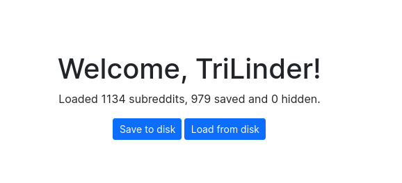
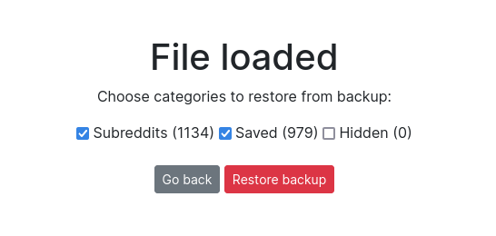

<h1 align="center">RedditManager</h1>

Backup and restore your Reddit account.

## How to run

RedditManager is a JavaScript web-app.

Everything is processed client-side, so there is no need for a special web server and no data ever leaves your computer.

All you need is your own web server running on port `8080`.

Then simply connect to the website from your browser of choice.

## Troubleshooting

Make sure any ad-blocking or anti-tracking extensions are disabled, as they tend to block suspicious requests to 3rd parties (like Reddit). Privacy-friendly browsers like Firefox or Brave might also cause issues with anti-tracking features.

Don't worry, this application won't steal your data. In fact, *almost* all of your data is lost the second you close the tab.

## Screenshots

## Credits

- `bootstrap.min.css` from https://github.com/twbs/bootstrap

- https://tabler-icons.io/i/tool was used for the icon.
